

<h1 align="center">MaxMur ❄️ NixOS Public Configuration</h1>

## Table of contents

- [Features](#-features)
- [File structure](#-file-structure)
- [Desktop preview](#%EF%B8%8F-desktop-preview)
  - [Hyprland](#-hyprland)
  - [Sway](#-sway)
- [Software](#-software)
- [Network topology](#-network-topology)
- [Hosts description](#%EF%B8%8F-hosts-description)
- [Keyboard](#%EF%B8%8F-keyboard)
- [Special thanks](#%EF%B8%8F-special-thanks)
- [Star history](#-star-history)

## ✨ Features

- ❄️ Flakes - for precise dependency management of the entire system.
- 🏡 Home Manager - to configure all used software for the user.
- 💽 Disko - for declarative disk management: luks + lvm + btrfs.
- ⚠️ Impermanence - to remove junk files and directories that are not specified in the config.
- 💈 Stylix - to customize the theme for the entire system and the software you use.
- 🍎 NixDarwin - to declaratively customize MacOS.
- 🔐 Lanzaboote - to securely boot the system.
- 🤖 MicroVMs - for secure separation of services.
- ⚡ Proxmox - to run non-NixOS machines.
- 💭 Nix Topology - to visualize the network topology.
- 🔥 Sops-Nix - to securely store sensitive data.
- 🎁 NVF - for the declarative configuration neovim
- 📁 Config file structure and modules with options.

## 📁 File structure

- [❄️ flake.nix](flake.nix) configuration entry point
- [🏡 home](home/default.nix) entry point for creating a home manager user
  - [🧩 modules](home/modules/) home manager modules
  - [♻️ overlays](home/overlays) home manager overlays
  - [👤 users](home/users) users configurations for home manager
    - [🧩 modules](home/users/maxmur/modules/) home manager user modules
- [📃 lib](lib/default.nix) helper functions for creating configurations
- [🧩 modules](modules/default.nix) common modules for nixos/nixDarwin/home-manager
- [♻️ overlays](overlays/) common overlays
- [❄️parts](parts/) flake parts modules
- [💀pkgs](pkgs/) self-sealed packages
- [🖥️ system](system/default.nix) entry point for creating a machine
  - [🏎️ machine](system/machine) machines configurations
    - [🚀 hostname](system/machine/pcbox/) starting the configuration of a specific machine
      - [🧩 modules](system/machine/pcbox/modules) machine modules
        - [💾 hardware](system/machine/pcbox/modules/hardware) machine hardware modules
  - [🧩 nixos](system/nixos) nixos modules/overlays/etc
  - [🧩 darwin](system/darwin) nixos modules/overlays/etc
- [📄 templates](templates/default.nix) templates for creating configuration parts

## 🖼️ Desktop preview

The images below may not represent the final system. Some parts may differ.

### ⚡ Hyprland

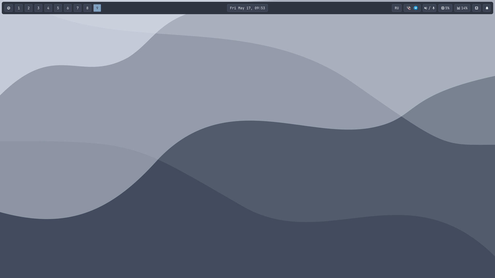

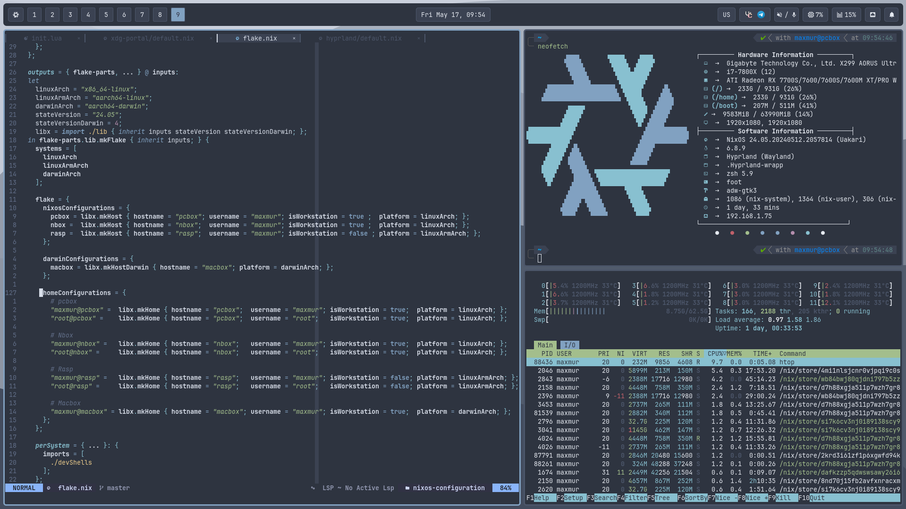

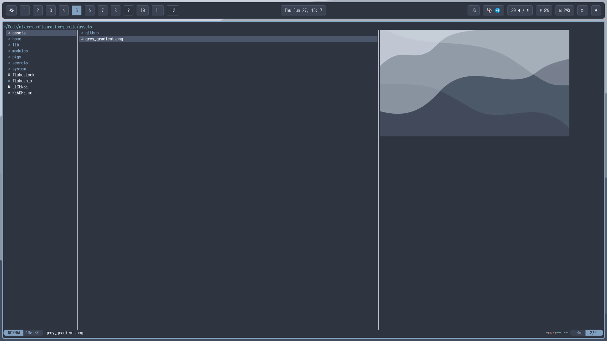

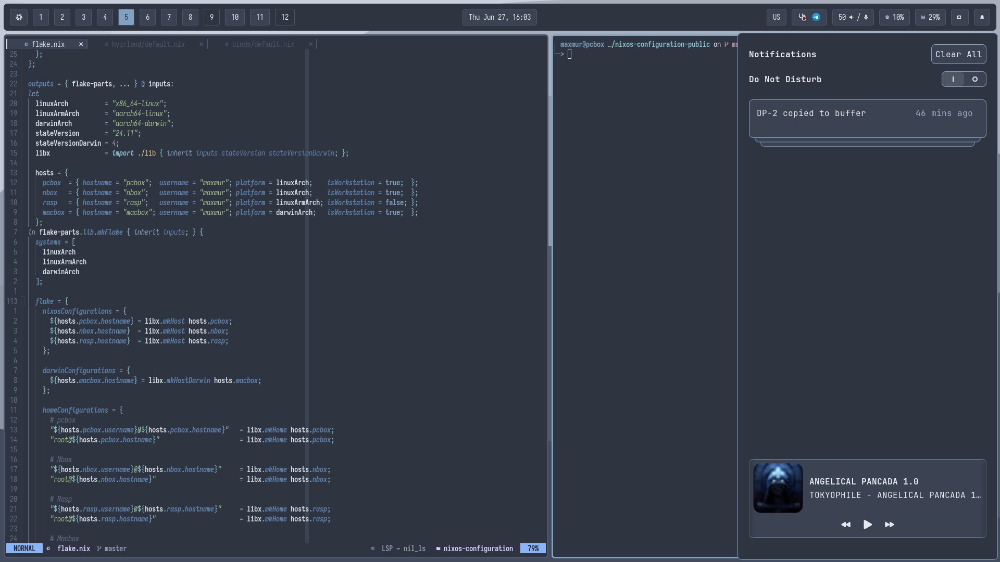

### 💪 Sway

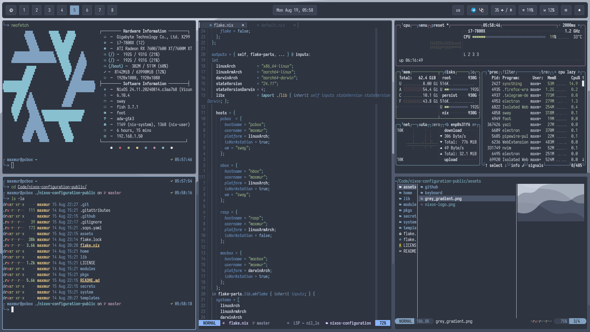

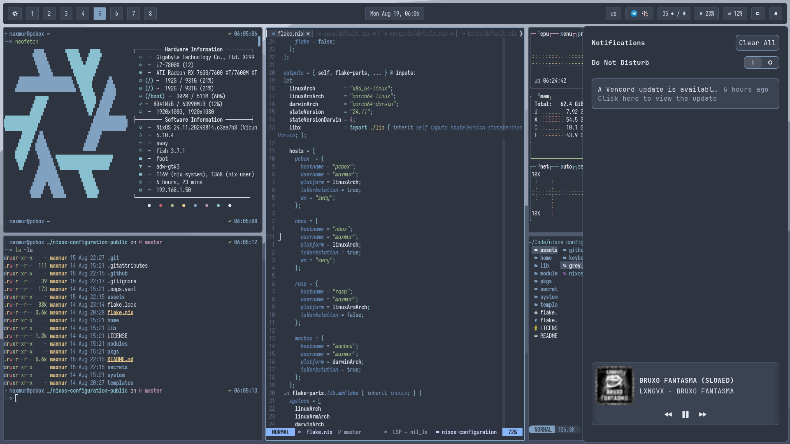

## 📘 Software

- OS - [**`NixOS`**](https://nixos.org/)
- WM - [**`Hyprland`**](https://hyprland.org/) or [**`Sway`**](https://github.com/swaywm/sway)
- Theme - [**`Nord`**](https://github.com/nordtheme/nord)
- Wallpapers - [**`Grey wave`**](assets/grey_gradient.png)
- Editor - [**`Neovim`**](https://neovim.io/)
- Bar - [**`Waybar`**](https://github.com/Alexays/Waybar)
- Terminal - [**`Foot`**](https://codeberg.org/dnkl/foot)
- Shell - [**`Fish`**](https://fishshell.com/)
- Promt - [**`Starship`**](https://starship.rs/)
- Filemanager - [**`Yazi`**](https://github.com/sxyazi/yazi)

## 👀 Network topology

These diagrams show the network topology of my home network.

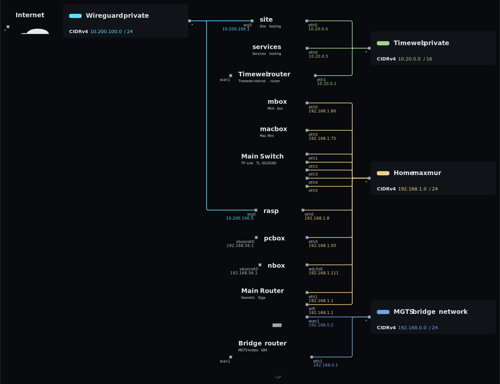

## 🖥️ Hosts description

| Hostname | Board                          | CPU              | RAM   | GPU                                  | OS    | State |
| -------- | ------------------------------ | ---------------- | ----- | ------------------------------------ | ----- | ----- |
| pcbox    | ASRock B650 Pro RS             | Ryzen 5 7500f    | 32GB  | Sapphire AMD Radeon RX 7600 XT PULSE | NixOS | OK    |
| nbox     | Asus ZenBook 2024 Oled         | Ultra7 155h      | 32GB  | Integrated Intel Arc (?)             | NixOS | OK    |
| hlbox    | X299 AORUS Ultra Gaming Pro-CF | i7-7800X         | 128GB | GTX 1050ti                           | NixOS | OK    |
| p8box    | P8 Mini Laptop                 | Intel N100       | 12GB  | Intel UHD Graphics                   | NixOS | OK    |
| rasp     | Raspberry Pi 4                 | Broadcom BCM2711 | 4GB   | Broadcom VideoCore VI                | NixOS | OK    |
| macbox   | Mac Mini M1                    | Apple Silicon M1 | 8GB   | Apple M1 8-Core GPU                  | MacOS | OK    |

## ⌨️ Keyboard

I use corne split with a modified [miryoku](https://github.com/manna-harbour/miryoku) layout. This is one of the most affordable and easy options for an ergonomic keyboard.

- WS Heavy Tactile switches
- Blank white PBT Cherry keycaps
- KBDFANS switch pads
- Tape mod
- O-rings
- Jincomso wrist rest

Layer 0 Main

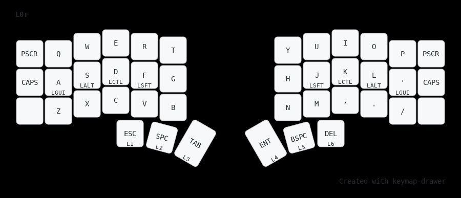

Layer 1 Media

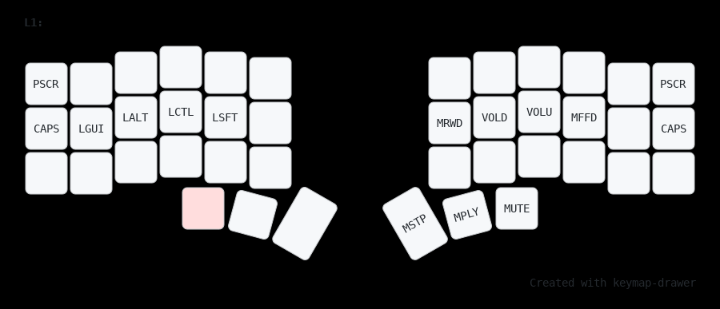

Layer 2 Nav

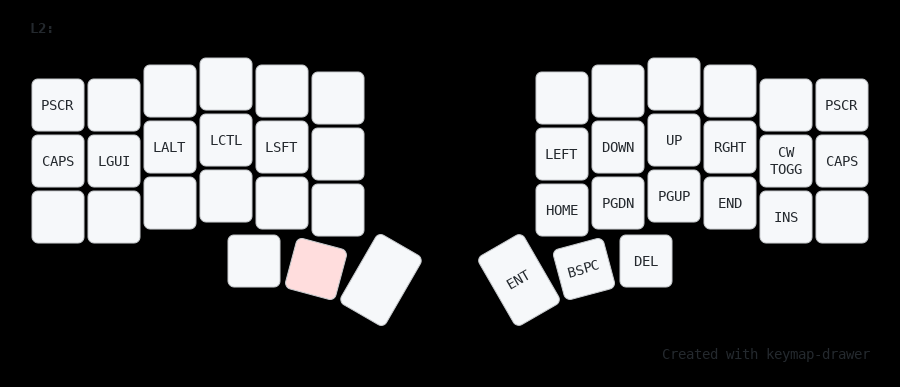

Layer 3 Mouse

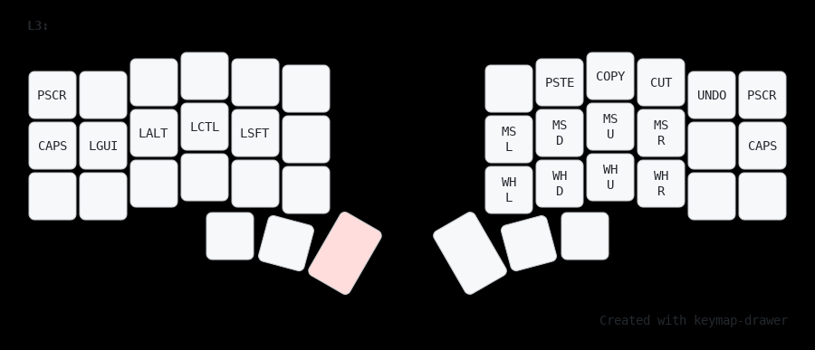

Layer 4 Sym

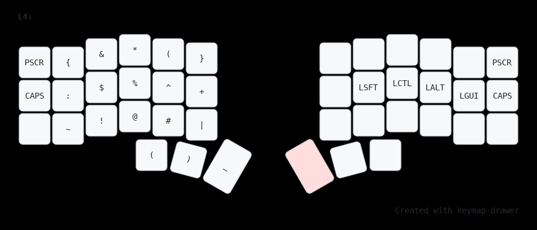

Layer 5 Num

Layer 6 Fun

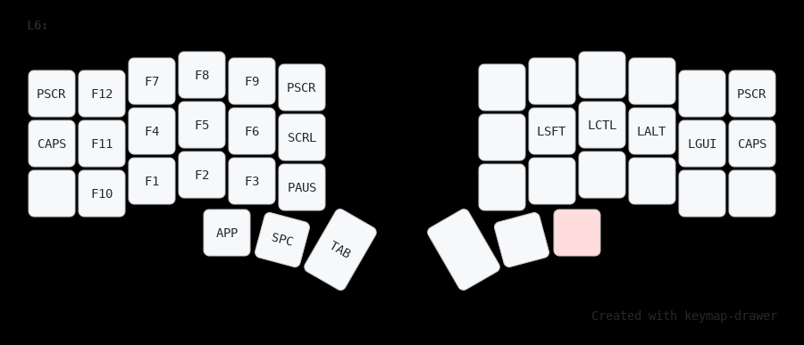

## ❤️ Special thanks

[Hand7s](https://github.com/s0me1newithhand7s)

[Kamillaova](https://github.com/Kamillaova)

[SHTRAMPANTUNC](https://github.com/SHTRAMPANTUNC)

[lazycaat](https://github.com/lazycaat)

[voronind-com](https://github.com/voronind-com)

[Corgiek](https://github.com/Corgiek)

## ⭐ Star History

<a href="https://star-history.com/#TheMaxMur/NixOS-Configuration&Date">
 <picture>
   <source media="(prefers-color-scheme: dark)" srcset="https://api.star-history.com/svg?repos=TheMaxMur/NixOS-Configuration&type=Date&theme=dark" />
   <source media="(prefers-color-scheme: light)" srcset="https://api.star-history.com/svg?repos=TheMaxMur/NixOS-Configuration&type=Date" />
   
 </picture>
</a>
