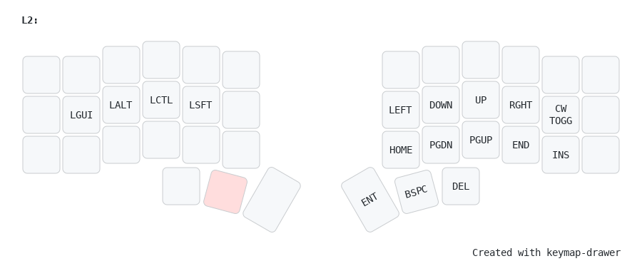
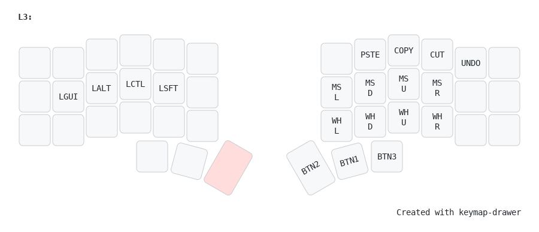
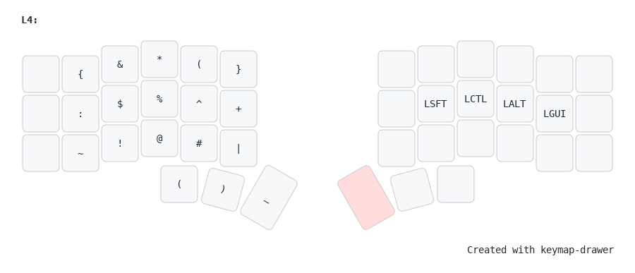
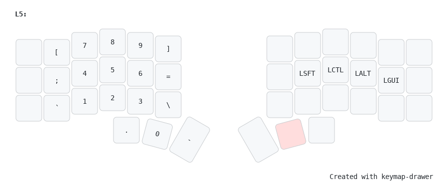
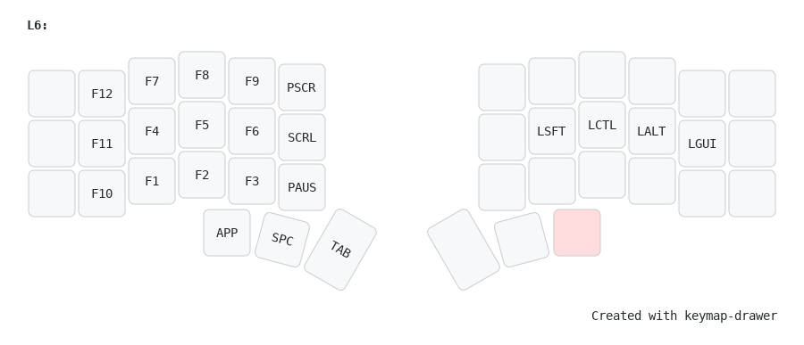

# MaxMur NixOS ❄️ Public Configuration

## Hosts description 🖥️

| Hostname | Board | CPU | RAM | GPU | OS | State |
| --- | --- | --- | --- | --- | --- | --- |
| pcbox | X299 AORUS Ultra Gaming Pro-CF | i7-7800X | 64GB | Sapphire AMD Radeon RX 7600 XT PULSE | NixOS | OK |
| nbox | Asus ZenBook 2024 Oled | Ultra7 155h | 32GB | Integrated Intel Arc (?) | NixOS | OK |
| rasp | Raspberry Pi 4 | Broadcom BCM2711 | 4GB | Broadcom VideoCore VI | NixOS | OK |
| macbox | Mac Mini M1 | Apple Silicon M1 | 8GB | Apple M1 8-Core GPU | MacOS | ? |

## About 📘

 - OS - [**`NixOS`**](https://nixos.org/)
 - WM - [**`Hyprand`**](https://hyprland.org/)
 - Theme - [**`Nord`**](https://github.com/nordtheme/nord)
 - Wallpapers - [**`Grey wave`**](assets/grey_gradient.png)
 - Editor - [**`Neovim`**](https://neovim.io/)
 - Bar - [**`Waybar`**](https://github.com/Alexays/Waybar)
 - Terminal - [**`Foot`**](https://codeberg.org/dnkl/foot)
 - Shell - [**`Fish`**](https://fishshell.com/)
 - Promt - [**`Starship`**](https://starship.rs/)
 - Filemanager - [**`Yazi`**](https://github.com/sxyazi/yazi)

## Desktop screenshots 🖼️

Screenshot 0 desktop

Screenshot 1 clear desktop

Screenshot 2 filemanager

Screenshot 3 notifications center

## Keyboard layout ⌨️

Layer 0

Layer 1

Layer 2

Layer 3

Layer 4

Layer 5

Layer 6

## Special thanks ❤️

[Hand7s](https://github.com/s0me1newithhand7s)

[Kamillaova](https://github.com/Kamillaova)

[SHTRAMPANTUNC](https://github.com/SHTRAMPANTUNC)

[lazycaat](https://github.com/lazycaat)

[voronind-com](https://github.com/voronind-com)

